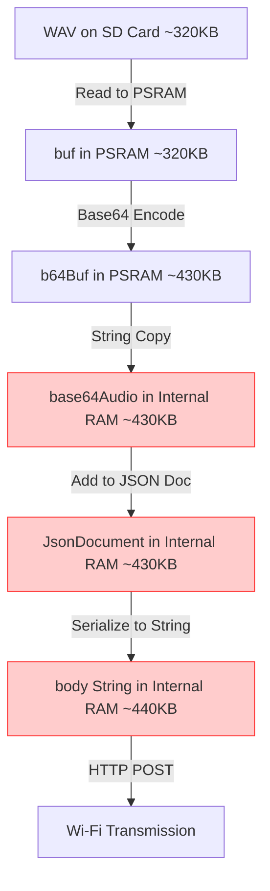

# Technical Audit & Review: LLM Integration & Memory Management

This report provides a detailed code audit and architectural review of the Melvin interactive voice assistant's AI logic, memory management, and configuration system based on [Agent.h](file:///d:/xiaoshi/say-ya/python416/include/Agent.h) and [Config.h](file:///d:/xiaoshi/say-ya/python416/include/Config.h).

---

## 1. Current Implementation Analysis

### 1.1 Config.h (Configuration System)
The configuration is managed by the `ConfigManager` and `MelvinConfig` structures:
*   **Storage**: Configuration is serialized to and deserialized from `/config.json` on the SD card (`SD_MMC`) in a standard 1-bit mode interface.
*   **APIs**: It defines strings to hold keys for three providers: `gemini_keys`, `groq_keys`, and `openrouter_keys`.
*   **Prompt Selection**: The system prompt is dynamically assembled in `getEffectivePrompt()` based on a `personality` setting (`"rick"`, `"calm"`, `"podcast"`, or a custom `system_prompt`), appending the `wake_word`.

### 1.2 Agent.h (AI Pipeline & SD Card History)
`MelvinAgent` coordinates the core AI interactions:
*   **History**: It handles dialogue persistence via `appendToHistory` and history retrieval with `getRecentHistory`. It reads the last `maxBytes` (default 2048) of `/history.json` and uses basic string parsing to locate the first valid opening brace `{` of the dialogue objects.
*   **RSS News**: It scrapes Lenta.ru RSS headlines to provide real-time context to the LLM.
*   **Key Cascade**: In `askAI()`, the agent splits the comma-separated key string for the chosen provider, trying each key sequentially if the API returns an error.
*   **Gemini Multimodal API Call**: 
    *   Reads the recorded WAV file from SD card.
    *   Allocates a raw buffer in PSRAM using `heap_caps_malloc(..., MALLOC_CAP_SPIRAM)`.
    *   Encodes raw bytes to Base64 via `mbedtls_base64_encode()`, storing the encoded data in a PSRAM buffer (`b64Buf`).
    *   Constructs a JSON body using the `ArduinoJson` library, adding the prompt context and inline audio data.
    *   Sends a POST request to `generativelanguage.googleapis.com` using `HTTPClient`.

---

## 2. Potential Issues & Compliance Gaps

During the code audit, several critical issues and compliance gaps were identified, categorized by severity below.

### 2.1 Memory Management & Heap Exhaustion (CRITICAL)
While raw buffers for recording (`phrase_buf`) and base64 encoding (`b64Buf`) are correctly allocated in PSRAM using `MALLOC_CAP_SPIRAM`, the subsequent transmission steps copy these buffers into the internal DRAM (SRAM), which will crash the system.



1.  **DRAM Duplication**: 
    *   Line 136 of `Agent.h` copies `b64Buf` (in PSRAM) into a standard Arduino `String`:
        ```cpp
        String base64Audio = String((char*)b64Buf);
        ```
        In ESP32 Arduino, the `String` class allocates memory on the default internal heap (DRAM) using standard `realloc/malloc`. For a 10-second audio recording, `base64Audio` is about 430 KB. Since the ESP32-S3 has only ~320KB of user-accessible DRAM (and usually less than 200KB free at runtime), **this allocation will fail, resulting in an immediate crash or silent failure**.
    *   Line 159 copies the entire JSON payload into another internal RAM `String`:
        ```cpp
        String body; serializeJson(doc, body);
        ```
        This duplicates the 430KB base64 audio *again* along with the text prompt, needing another 440KB in DRAM.

2.  **ArduinoJson Overhead**:
    *   Adding `base64Audio` to `JsonDocument` creates a third reference or copy in RAM, increasing the memory pressure. 

### 2.2 Lack of Provider-Level Cascade (HIGH / Compliance Gap)
*   **The Issue**: `askAI()` only falls back to the next key *for the same provider* (`cfg.llm_provider`). If all Gemini keys fail, it returns an error and aborts.
*   **Compliance Violation**: The `AGENTS.md` rules explicitly state:
    > "Если Gemini 3.5 Flash недоступен, код должен автоматически переключаться на Groq или OpenRouter." (If Gemini 3.5 Flash is unavailable, the code must automatically switch to Groq or OpenRouter).
*   **API Incompatibility**: The current routing method `callProviderAPI()` returns an error if `cfg.llm_provider` is not `"gemini"`:
    ```cpp
    return "Error: " + cfg.llm_provider + " audio input not yet implemented.";
    ```
    To support actual failover to Groq or OpenRouter, the system must transcribe the audio first (e.g., using Groq's Whisper API) and then pass the transcribed text to the selected LLM.

### 2.3 Invalid/Malformed History JSON Format (MEDIUM)
The dialogue history serialization in `appendToHistory` is syntactically broken:
```cpp
void appendToHistory(String role, String text) {
    File file = SD_MMC.open("/history.json", FILE_APPEND);
    if (!file) {
        file = SD_MMC.open("/history.json", FILE_WRITE);
        file.print("[");
    } else {
        file.print(",");
    }
    // ... serializeJson(doc, file) ...
    file.close();
}
```
*   **Format Breakdown**: The opening bracket `[` is printed when the file is created, and elements are separated by commas. However, **the closing bracket `]` is never appended**. This makes `/history.json` an invalid JSON file.
*   **Fragile Parser**: `getRecentHistory()` reads the last 2048 bytes of the file and searches for the first `{`. While this acts as a quick workaround to read the most recent messages, it will break if the model's text response itself contains braces (e.g., code snippets, markdown notation, JSON examples).
*   **Infinite Growth**: The file grows indefinitely. Over time, appending and seeking on a massive file will degrade SD card read/write speeds, triggering watchdog timeouts.

### 2.4 Unsafe API Response Parsing (MEDIUM)
In `callGemini()` (lines 167-168):
```cpp
JsonDocument res; deserializeJson(res, resp);
String answer = res["candidates"][0]["content"]["parts"][0]["text"].as<String>();
```
*   If `deserializeJson()` fails (due to connection reset or truncated response) or if the API returns a response without candidates (e.g., due to content safety blocks or parsing errors), indexing into `res["candidates"][0]` will result in a null reference or empty string without proper error handling.

---

## 3. Proposed Fixes & Architectural Enhancements

### 3.1 Zero-Copy JSON Streaming to HTTP Client (Resolves 2.1)
Instead of serializing the entire JSON payload (including the massive base64 string) into an internal RAM `String`, we can stream the JSON structure directly to the server chunk-by-chunk. This keeps the base64 string solely inside PSRAM and avoids all internal RAM allocations.

Here is a proposed implementation for `callGemini` using chunked transmission:

```cpp
// Direct socket/client streaming to bypass internal RAM allocation
WiFiClientSecure client;
client.setInsecure();
HTTPClient http;
http.setTimeout(30000);
http.begin(client, "https://generativelanguage.googleapis.com/v1beta/models/gemini-1.5-flash:generateContent?key=" + key);
http.addHeader("Content-Type", "application/json");

// Define parts of the JSON
String prompt = cfg.getEffectivePrompt() + "\n\nNEWS:\n" + news + "\n\nRECENT CONTEXT:\n" + history;

// Escape prompt for JSON manually or with a mini JsonDocument
JsonDocument headerDoc;
headerDoc["contents"][0]["role"] = "user";
headerDoc["contents"][0]["parts"][0]["text"] = prompt;
String headerStr;
serializeJson(headerDoc, headerStr);

// Split headerStr at the end of the text part to insert inline_data
// headerStr is small (~2KB), so this is completely safe for DRAM.
int insertPos = headerStr.lastIndexOf("}]}");
String jsonStart = headerStr.substring(0, insertPos) + ",{\"inline_data\":{\"mime_type\":\"audio/wav\",\"data\":\"";
String jsonEnd = "\"}}]}";

// Compute total content length to avoid chunked transfer-encoding if not supported
size_t totalLength = jsonStart.length() + b64Len + jsonEnd.length();
http.addHeader("Content-Length", String(totalLength));

// Perform POST with a custom stream or manual payload write
// Using the custom print interface to send data directly without copying buffers
int code = http.POST((uint8_t*)nullptr, 0); // Open connection
// Send data parts directly
WiFiClient* stream = http.getStreamPtr();
if (stream) {
    stream->print(jsonStart);
    // Write the Base64 buffer directly from PSRAM (zero-copy)
    stream->write((const uint8_t*)b64Buf, b64Len);
    stream->print(jsonEnd);
}
```

### 3.2 Dual-Stage Provider Cascade (Resolves 2.2)
Refactor `askAI` to fallback not just to the next key, but to the next **provider** if all keys of the current provider fail.

```cpp
String askAI(const String& audioPath, const MelvinConfig& cfg) {
    // Array of fallback providers in order
    String providers[] = { cfg.llm_provider, "gemini", "groq", "openrouter" };
    
    for (const String& currentProvider : providers) {
        String keys = (currentProvider == "gemini") ? cfg.gemini_keys : 
                     (currentProvider == "groq") ? cfg.groq_keys : cfg.openrouter_keys;
                     
        if (keys.length() < 5) continue; // Skip if no keys are configured
        
        int start = 0;
        int end = keys.indexOf(',');
        while (true) {
            String currentKey = (end == -1) ? keys.substring(start) : keys.substring(start, end);
            currentKey.trim();
            
            // Execute request using the selected provider
            String result = callProviderAPI(audioPath, currentProvider, cfg, currentKey);
            if (!result.startsWith("Error API") && !result.startsWith("Error: Unsupported")) {
                appendToHistory("user", "[Voice Input]");
                appendToHistory("model", result);
                return result;
            }
            
            if (end == -1) break;
            start = end + 1;
            end = keys.indexOf(',', start);
        }
    }
    return "Error: All keys and fallback providers failed.";
}
```

### 3.3 Implementing Transcription (STT) for Groq/OpenRouter Fallbacks
To support Groq and OpenRouter, add a Whisper transcribing client inside `callProviderAPI`:
```cpp
String callProviderAPI(const String& audioPath, const String& provider, const MelvinConfig& cfg, String key) {
    if (provider == "gemini") {
        return callGemini(audioPath, getRSSHeadlines(cfg.rss_url), getRecentHistory(), cfg, key);
    }
    
    // Fallback: Transcribe audio to text via Groq/OpenRouter Whisper API first
    String transcribedText = transcribeAudioWhisper(audioPath, key);
    if (transcribedText.startsWith("Error")) {
        return "Error API Whisper Transcription failed";
    }
    
    // Query text LLM
    if (provider == "groq") {
        return callGroqText(transcribedText, key);
    } else if (provider == "openrouter") {
        return callOpenRouterText(transcribedText, key);
    }
    
    return "Error: Unsupported provider " + provider;
}
```

### 3.4 Shifting from Broken JSON Array to JSON Lines (JSONL) (Resolves 2.3)
Instead of maintaining an open-ended JSON array (`[...]`), write the history file in the **JSON Lines (JSONL)** format.
*   **Format**: Each dialogue exchange is a single-line JSON object followed by a newline `\n`.
*   **Advantages**: 
    1.  Appending is a clean write operation: `serializeJson(doc, file); file.println();`.
    2.  No need for brackets (`[` or `]`) or tracking separating commas.
    3.  Parsing is highly robust: we can seek backwards, grab the last few lines, and deserialize each line independently.
    4.  Capping file size (e.g., removing the oldest lines once the file exceeds 100 lines) becomes straightforward.

```cpp
void appendToHistoryJSONL(String role, String text) {
    File file = SD_MMC.open("/history.jsonl", FILE_APPEND);
    if (!file) return;
    
    JsonDocument doc;
    doc["role"] = role;
    doc["content"] = text;
    serializeJson(doc, file);
    file.println(); // Newline separator
    file.close();
}
```

---

## 4. Compliance Checklist

The following table reviews the current implementation against the hardware and design rules specified in `AGENTS.md` and `GEMINI.md`:

| Requirement / Rule | Source | Status | Comments |
| :--- | :--- | :--- | :--- |
| **PA_CTRL (GPIO46) LOW on boot** | `AGENTS.md` | **Compliant** | Set as `OUTPUT` and written `LOW` at start of `setup()`. |
| **PA_CTRL HIGH only during I2S TX** | `AGENTS.md` | **Compliant** | Enabled before playing WAV, set `LOW` immediately after. |
| **MCLK active before I2C init** | `AGENTS.md` | **Compliant** | `i2s_duplex_init()` runs before `initES8311()`. |
| **Switch I2S RX/TX with disable/delay** | `AGENTS.md` | **Compliant** | Implemented using a 10ms delay in `switchToRX()` / `switchToTX()`. |
| **SD card in 1-bit mode (FAT32)** | `AGENTS.md` | **Compliant** | Configured with `SD_MMC.begin("/sdcard", true)`. |
| **Audio Standard (16kHz / 16-bit / Mono)** | `AGENTS.md` | **Compliant** | Followed in `Recorder.h` and explicitly set in Google TTS request. |
| **Audio/Base64 Buffers in PSRAM** | `AGENTS.md` | **Compliant** | Used correctly for raw buffers (`phrase_buf`, `b64Buf`, `decoded`). |
| **Automatic Provider Fallback** | `AGENTS.md` | **Non-Compliant** | **Missing.** Code does not switch to Groq/OpenRouter on Gemini failure. |
| **ES8311 Working Registers** | `GEMINI.md` | **Compliant** | Volume, Routing, and Output Gain registers set properly in `initES8311()`. |
