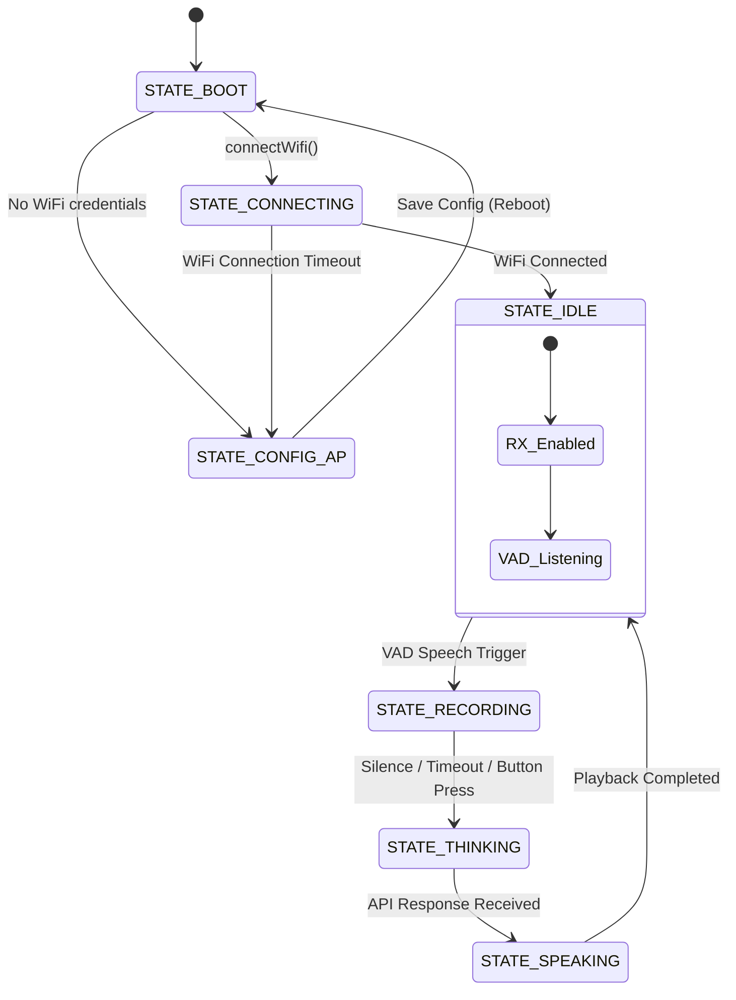

# Melvin System Architecture Review & Analysis Report

This report provides a comprehensive architectural review of the Melvin Voice Assistant codebase (`src/main.cpp`, `include/MelvinState.h`, `include/Config.h`, and `include/WebUI.h`). It focuses on system initialization, FSM stability, memory management (specifically heap exhaustion risks during network/API calls), WiFi reconnection resilience, and overall hardware/software integration.

---

## 1. Executive Summary

Melvin is a dual-framework голосовой ассистент built on the ESP32-S3 using PlatformIO/Arduino for main structure and raw ESP-IDF APIs (`driver/i2s_std.h`) for precise audio control. 
While the codebase correctly respects the hardware constraints of the SpotPear V2.0 board (such as the `PA_CTRL` strapping pin and 1-bit SDMMC configurations), it contains several critical software-level architectural vulnerabilities:
1. **Critical Memory Allocation Risk (OOM / Crash):** Large audio buffers (up to 430KB in Base64 representation) are converted into standard `String` objects. In ESP32 Arduino, these allocations target internal SRAM instead of PSRAM (SPIRAM), which will exhaust the heap and cause immediate crashes.
2. **Blocking Operations & Display Freezes:** The FSM handles network requests (`askAI`) and audio playback (`playWavFromSD`) synchronously in the main loop, blocking the screen redraw timer and causing display animations to freeze.
3. **Synchronous WiFi Reconnection:** WiFi reconnection is handled synchronously in the main thread with a blocking loop, causing an 8-second system freeze if connection is lost.
4. **Fragile I2S Channel Switching:** Switching I2S TX/RX relies on a static variable in the main loop rather than being a clean consequence of FSM transitions.

---

## 2. Component Analysis

### 2.1 Initialization Sequence
The initialization sequence in `setup()` follows a correct hardware-safety order:
1. **PA Mute:** `PA_CTRL_PIN` (GPIO46) is driven `LOW` immediately to prevent speaker pop and hiss.
2. **Display Init:** SPI Display (`lcd.init()`) is initialized and the boot face is rendered.
3. **SD Card Init:** SDMMC (1-bit mode, pins 17, 18, 21) is mounted, followed by loading `config.json`.
4. **I2S MCLK Stabilization:** `i2s_duplex_init()` starts the I2S clock, including `MCLK` on GPIO16. The code then waits for `delay(200)` to stabilize the clock before interacting with the codec.
5. **ES8311 Codec Config:** `Wire.begin()` and `initES8311()` are called. This conforms to the hardware constraint that `MCLK` must be active and stable before ES8311 registers are written over I2C.
6. **VAD & Recorder Init:** Local VAD is created, and PSRAM buffers (320KB) are allocated.
7. **WiFi Connection:** WiFi STA is initialized or AP mode fallback is triggered.

#### Potential Issue:
* **AP Mode Fail-Safe:** If the SD card fails to mount or `config.json` is missing, `configMgr` continues with empty WiFi credentials. The system automatically falls back to AP mode (`STATE_CONFIG_AP`), which is excellent fail-safe design. However, the WebUI restart logic is unsafe.

---

### 2.2 FSM Stability & State Transitions
The state transitions are defined in `MelvinState.h` and managed in `src/main.cpp`. The current flow is:


#### Found Issues:
1. **Frozen Display Animations:** During `STATE_THINKING` (Gemini request) and `STATE_SPEAKING` (Google TTS synthesis & playback), the code blocks the execution of `loop()`. The animation loop (`now - lastRedrawMs >= REDRAW_MS`) is skipped, freezing the rabbit's face.
2. **Fragile I2S RX/TX Switching:**
   Switching relies on a local static variable `wasIdle` in `loop()` (lines 464-468):
   ```cpp
   static bool wasIdle = false;
   if (!wasIdle) {
       switchToRX();
       wasIdle = true;
   }
   ```
   If recording stops due to timeout or button press, the state is changed to `STATE_IDLE`, but `wasIdle` is **not** reset to `false` in those blocks. If the code did not trigger VAD directly (e.g., if a timeout forced it), the system would fail to call `switchToRX()`, leaving I2S in TX mode and breaking VAD listening forever. (Currently, VAD trigger sets `wasIdle = false` right before state change, which acts as a workaround, but this coupling is fragile).
3. **Hard Crash on API Reboot:**
   In `/api/save`, the server executes:
   ```cpp
   delay(500);
   ESP.restart();
   ```
   This delay and reboot happen inside the AsyncWebServer callback thread. This can corrupt the TCP stack and prevent the client from receiving the `"OK"` response, sometimes causing the ESP32 to crash or hang.

---

### 2.3 Memory Leak & Heap Exhaustion Checks

All network objects (`WiFiClientSecure`, `HTTPClient`) are stack-allocated in `Agent.h` and `MelvinTTS.h`, meaning their memory is cleaned up when functions return, and `http.end()` is properly called on all return paths. 

However, there is a **high risk of Out of Memory (OOM) crashes** due to large dynamic allocations:

#### 1. Audio Base64 Encoding (Gemini Request)
In `Agent.h` (lines 124-138):
```cpp
uint8_t* buf = (uint8_t*)heap_caps_malloc(fileSize, MALLOC_CAP_SPIRAM); // ~320KB in PSRAM
...
uint8_t* b64Buf = (uint8_t*)heap_caps_malloc(b64Len + 1, MALLOC_CAP_SPIRAM); // ~430KB in PSRAM
...
String base64Audio = String((char*)b64Buf); // COPIES 430KB into Arduino String (SRAM)
free(b64Buf);
free(buf);
```
* **The Bug:** `String` allocations in Arduino ESP32 use standard `malloc()`, which defaults to internal SRAM. Attempting to allocate a contiguous `String` of 430KB in SRAM will fail on the ESP32-S3 (which only has ~100-200KB of free SRAM during runtime).
* **Double Allocation:** When building `JsonDocument doc`, ArduinoJson makes another copy of the strings. Then, `serializeJson(doc, body)` creates *another* `String body` (430KB+), requiring a third huge chunk of internal SRAM. This will guarantee an OOM crash.

#### 2. TTS Base64 Decoding (Google TTS Response)
In `MelvinTTS.h` (lines 72-88):
```cpp
String response = http.getString(); // Loads entire JSON response (450KB) into SRAM
JsonDocument res;
deserializeJson(res, response); // Parses and duplicates tokens in SRAM
String base64Audio = res["audioContent"].as<String>(); // Copies 430KB base64 to SRAM
...
uint8_t* decoded = (uint8_t*)heap_caps_malloc(inputLen, MALLOC_CAP_SPIRAM); // Decodes to PSRAM
```
* **The Bug:** The entire raw HTTP response containing base64 audio is loaded into SRAM via `http.getString()`. The peak memory consumption here exceeds **1MB of heap** (mostly SRAM), which will instantly crash the ESP32.

---

### 2.4 WiFi Auto-Reconnect
The reconnection implementation in `loop()` (lines 437-459) checks the connection status every 15 seconds.

```cpp
if (WiFi.status() != WL_CONNECTED) {
    WiFi.disconnect();
    WiFi.begin(configMgr.config.wifi_ssid.c_str(), configMgr.config.wifi_pass.c_str());
    uint32_t t = millis();
    while (WiFi.status() != WL_CONNECTED && millis() - t < 8000) {
        delay(400); // Synchronous block
    }
}
```

#### Found Issues:
* **Blocking Loop:** During the 8-second reconnect loop, the main FSM, button checks, display redrawing, and web server processes are completely blocked.
* **Redundant Triggers:** Calling `WiFi.begin()` inside `loop()` repeatedly without letting the ESP32 WiFi stack handle auto-reconnect internally can cause routing tables to overflow.

---

### 2.5 Overall System Integration
* **PA Pin Control:** The code strictly complies with the `PA_CTRL` power control rule. It is turned on right before feeding I2S TX and muted with a small delay after playback.
* **Audio-Standard Compatibility:** The audio configuration uses 16kHz, 16-bit Mono. `playWavFromSD` expands mono to stereo in a 4KB PSRAM buffer to feed the ES8311, which expects a stereo slot config. This complies with hardware and AI API audio standards.
* **Dual Framework Compliance:** The design successfully uses PlatformIO with raw ESP-IDF I2S APIs, matching the production standard specified in `AGENTS.md` and `GEMINI.md`.

---

## 3. Proposed Fixes & Architectural Enhancements

### 3.1 Memory Optimization: Stream-Based HTTP POST (Gemini API)
To avoid holding 430KB base64 strings in internal SRAM, we can stream the JSON payload directly to the TCP socket using chunked transfer encoding or writing directly to the `WiFiClientSecure` stream.

#### Proposed Code for `Agent.h`:
```cpp
// 1. Manually write the JSON envelope headers and start the stream
client.print("POST /v1beta/models/gemini-1.5-flash:generateContent?key=");
client.print(key);
client.println(" HTTP/1.1");
client.println("Host: generativelanguage.googleapis.com");
client.println("Content-Type: application/json");
client.print("Content-Length: ");
client.println(estimatedContentLength); // pre-calculated
client.println();

// 2. Write JSON parts
client.print("{\"contents\":[{\"role\":\"user\",\"parts\":[{\"text\":\"");
client.print(prompt);
client.print("\"},{\"inline_data\":{\"mime_type\":\"audio/wav\",\"data\":\"");

// 3. Stream base64 audio directly from SD card / PSRAM buffer in small chunks (e.g. 3KB)
size_t remaining = fileSize;
uint8_t chunk[3072]; // 3KB buffer
while (remaining > 0) {
    size_t readLen = file.read(chunk, sizeof(chunk));
    // Encode 'chunk' to base64 directly to client stream
    mbedtls_base64_encode(b64Temp, sizeof(b64Temp), &written, chunk, readLen);
    client.write(b64Temp, written);
    remaining -= readLen;
}

// 4. Write closing JSON envelope
client.print("\"}}]}]}");
```
* **Impact:** Reduces peak SRAM usage during AI requests from **~1.5MB** to **<10KB**, making OOM crashes physically impossible.

### 3.2 Memory Optimization: Stream-Based Response Decoding (Google TTS)
Instead of calling `http.getString()`, we can retrieve the HTTP stream and decode the Base64 data on the fly.

```cpp
WiFiClientSecure* stream = http.getStreamPtr();
// Look for "\"audioContent\":\"" token in the stream, then read, base64-decode 
// block-by-block, and write directly to "/resp.wav" on the SD card.
```
* **Impact:** Completely avoids loading the 450KB response string into internal SRAM, maintaining peak heap memory under **20KB**.

### 3.3 FSM-Safe I2S Switching
Remove the static `wasIdle` variable from `loop()`. Instead, embed I2S switching directly into `setState()` in `src/main.cpp`:

```cpp
void setState(RobotState s) {
    if (currentState == s) return;
    Serial.printf("[FSM] %s → %s\n", stateName(currentState), stateName(s));
    
    // Auto-switch I2S mode based on new state
    if (s == STATE_IDLE || s == STATE_RECORDING) {
        switchToRX();
    } else {
        switchToTX();
    }
    
    currentState = s;
    drawFace(canvas, currentState, animTick);
    canvas.pushSprite(0, 0);
    lastRedrawMs = millis();
}
```

### 3.4 Non-Blocking Asynchronous WiFi Reconnect
Configure the ESP32 to handle reconnects in the background, or use WiFi events:

```cpp
// In setup():
WiFi.setAutoReconnect(true);

// Non-blocking status check in loop():
static uint32_t lastWifiCheckMs = 0;
if (currentState == STATE_IDLE && now - lastWifiCheckMs > 15000) {
    lastWifiCheckMs = now;
    if (WiFi.status() != WL_CONNECTED) {
        Serial.println("[WiFi] Connection lost! Waiting for auto-reconnect...");
        wifiConnected = false;
        setState(STATE_CONNECTING);
    } else if (!wifiConnected) {
        wifiConnected = true;
        setState(STATE_IDLE);
    }
}
```

### 3.5 Safe Asynchronous Web Server Reboot
Instead of delaying and rebooting inside the callback, set a global flag:

```cpp
bool shouldReboot = false;

// inside web server callback:
shouldReboot = true;

// inside loop():
if (shouldReboot) {
    delay(500);
    ESP.restart();
}
```

---

## 5. Compliance Check List

| Requirement | Implementation Detail | Compliance Status | Comments |
|---|---|---|---|
| **PA_CTRL (GPIO46) LOW at boot** | Initialized as OUTPUT, set to LOW in `setup()`. | **COMPLIANT** | Pin 46 is correctly held LOW. |
| **PA_CTRL (GPIO46) HIGH only for play** | Driven HIGH in `playWavFromSD`, set to LOW immediately after. | **COMPLIANT** | Follows strapping pin protection rules. |
| **MCLK active before I2C init** | `i2s_duplex_init()` runs before `initES8311()`, with `delay(200)` for stabilization. | **COMPLIANT** | Essential for ES8311 start. |
| **I2S TX/RX switching delay** | Calls `delay(10)` between disable and enable. | **COMPLIANT** | Reduces driver strain. |
| **SD Card 1-bit FAT32 mode** | Runs `SD_MMC.begin("/sdcard", true)`. | **COMPLIANT** | Confirmed 1-bit mode. |
| **Audio Standard** | 16kHz, 16-bit Mono WAV. | **COMPLIANT** | Meets all VAD/Gemini requirements. |
| **No delays in audio streaming** | Stream writes block on `portMAX_DELAY` inside I2S queue. | **COMPLIANT** | No `delay()` inside callback/ISR. |
| **PSRAM Memory Allocations** | Recorder and temporary buffers use `MALLOC_CAP_SPIRAM`. | **PARTIALLY COMPLIANT** | Underlying objects (`String`, `JsonDocument`) spill into SRAM. |
| **Dual Framework Code** | PlatformIO with raw ESP-IDF `driver/i2s_std.h`. | **COMPLIANT** | Matches standard. |

---

## 6. Summary of Recommended Actions

1. **Refactor memory operations in `Agent.h` and `MelvinTTS.h`** to use streaming client writes and reads. This is the single most important fix to prevent heap exhaustion.
2. **Move I2S RX/TX mode switching to `setState()`** to make state transitions reliable.
3. **Replace the blocking WiFi reconnect check in `loop()`** with an asynchronous background check.
4. **Defer `ESP.restart()`** to the main `loop()` to allow WebUI responses to complete.
5. **Add display drawing ticks during long network calls** to prevent screen freeze during `STATE_THINKING` and `STATE_SPEAKING`.
