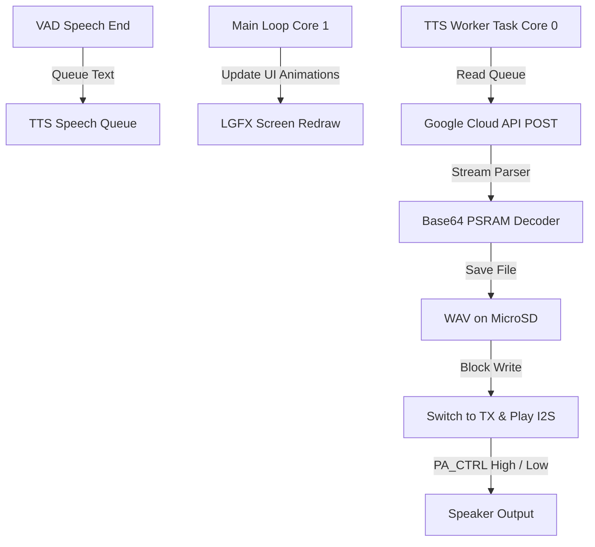

# Melvin AI Robot - Text-to-Speech (TTS) Synthesizer Review

- **Author**: Antigravity Pair Programmer
- **Target Subsystems**: [include/MelvinTTS.h](file:///d:/xiaoshi/say-ya/python416/include/MelvinTTS.h), [src/main.cpp](file:///d:/xiaoshi/say-ya/python416/src/main.cpp)
- **Target Hardware**: SpotPear ESP32-S3-1.54 V2.0 (ES8311 Audio Codec, NS4150B Amp)
- **Date**: June 2, 2026

---

## Executive Summary

The Melvin TTS subsystem integrates Google Cloud Text-to-Speech REST API (`v1/text:synthesize`) with a manual PCM mono-to-stereo audio player to bypass high-level audio library issues. 

While the core functionality correctly enforces the **16kHz sample rate** and leverages **PSRAM (`MALLOC_CAP_SPIRAM`)** for the decoded audio buffers, several critical issues were discovered during this review:
1. **Severe Memory Duplication**: Multiple copies of the massive base64-encoded audio payload are kept in the heap during parsing, resulting in high OOM (Out-of-Memory) risk.
2. **Unsafe Truncation Limit**: The 500-character limit can yield over **2 MB** of base64 JSON payload, which will reliably crash the ESP32.
3. **UI/Face Freeze**: Synchronous, blocking HTTP requests and audio write loops freeze screen updates for 10+ seconds.
4. **No PSRAM Allocation Fallback**: On PSRAM failure, decoding fails without fallback, and the device attempts to play a truncated, 0-byte corrupt WAV file.

A refactored, stream-oriented implementation is proposed to optimize memory usage, establish safety thresholds, and keep display animations smooth.

---

## 1. Current Implementation Analysis

### 1.1 Google Cloud TTS API Workflow
In [MelvinTTS.h](file:///d:/xiaoshi/say-ya/python416/include/MelvinTTS.h), the method `synthesizeGoogle(String text, const MelvinConfig& cfg)` executes the following pipeline:
1. **Truncation**: Shortens input string to 500 characters.
2. **Network Request**: Uses `WiFiClientSecure` with `client.setInsecure()` and `HTTPClient` to send a synchronous JSON payload to `texttospeech.googleapis.com` via a POST request.
3. **Payload Structure**:
   ```json
   {
     "input": { "text": "<text>" },
     "voice": { "languageCode": "ru-RU", "name": "<tts_voice>" },
     "audioConfig": { "audioEncoding": "LINEAR16", "sampleRateHertz": 16000 }
   }
   ```
4. **Buffer Capture**: Reads the entire HTTP response body into a `String` object via `http.getString()`.
5. **Parsing**: Deserializes the JSON tree via `ArduinoJson`, reads the `audioContent` string containing the Base64 WAV data, and copies it to a separate `String` object.
6. **PSRAM Allocation**: Allocates a buffer in SPIRAM matching the size of the base64 encoded string (`inputLen`).
7. **Decoding**: Calls `mbedtls_base64_decode` to populate the SPIRAM buffer.
8. **Storage & Playback**: Writes the decoded bytes to the SD card at `/resp.wav` and triggers playback via `playWavFromSD`.

### 1.2 Audio Standard Compliance
- **Sample Rate**: Google Cloud TTS is explicitly set to `"sampleRateHertz": 16000`, matching Melvin's static hardware config (`#define SAMPLE_RATE 16000`). This ensures that Google does not default to 24kHz or higher, which would pitch-shift or distort output during 16kHz I2S master clock playback.
- **Format**: Evaluates as `LINEAR16` (16-bit linear PCM). The response includes a WAV container containing a `"data"` chunk.

### 1.3 Memory Architecture
- **PSRAM Utilization**: The decoded audio data is correctly allocated using `heap_caps_malloc(inputLen, MALLOC_CAP_SPIRAM)`. The `sdkconfig.esp32s3` setting `CONFIG_SPIRAM_USE_MALLOC=y` ensures that general heap allocations greater than 16KB will automatically seek PSRAM first.

---

## 2. Potential Issues & Risks

### ⚠️ [CRITICAL] Issue 1: Heap Exhaustion via Triple Payload Copy
The current HTTP response parsing routine buffers the base64-encoded audio multiple times:
1. `String response = http.getString();` reads the raw response (approx. 200KB to 2MB) into a contiguous string.
2. `deserializeJson(res, response);` copies all parsed strings into the `JsonDocument` memory pool, duplicating the base64 data.
3. `String base64Audio = res["audioContent"].as<String>();` duplicates the base64 string a third time into a dynamic `String`.

This generates **three concurrent copies** of the base64 payload. If a response contains a 300KB base64 audio stream, it consumes nearly **900KB of heap memory**, easily causing allocation failures or heap fragmentation crashes.

### ⚠️ [CRITICAL] Issue 2: Insecure Character Truncation Limit
The text is truncated to 500 characters:
```cpp
if (text.length() > 500) { text = text.substring(0, 500); }
```
At a standard Russian speaking rate (10–12 characters/sec), 500 characters results in up to **50 seconds** of speech.
- $50 \text{ seconds} \times 16000 \text{ samples/sec} \times 2 \text{ bytes/sample} = 1,600,000 \text{ bytes (1.6 MB) PCM WAV}$.
- Base64 encoding size: $1.6 \text{ MB} \times \frac{4}{3} \approx 2.13 \text{ MB}$.
- Loading three copies of a 2.13 MB payload requires **6.4 MB of heap space**.
Even with 8MB Octal PSRAM, parsing such large JSON structures synchronously inside ArduinoJson will exhaust resources or trigger CPU watchdog resets due to execution time.

### 🔴 [UI BUG] Issue 3: Screen Redraw Frozen During TTS and Playback
The screen updates via the `loop()` function in [main.cpp](file:///d:/xiaoshi/say-ya/python416/src/main.cpp#L426-L435) every `80ms`. However:
1. `http.POST(body)` blocks the thread for the duration of the network request (1–3 seconds).
2. `playWavFromSD` contains a synchronous read/write loop that blocks the main thread for the entire duration of the audio playback (up to 20+ seconds).
During this time, the robot's dynamic face and screen animations freeze completely, degrading user experience.

### 🔍 [STABILITY] Issue 4: Missing Memory Fallback & Double Playback Bug
- **Allocation Fallback**: `MelvinTTS.h` uses `heap_caps_malloc(..., MALLOC_CAP_SPIRAM)`. If SPIRAM is fragmented or exhausted, it returns `NULL`. Unlike `main.cpp` (which falls back to standard `malloc`), the code fails silently.
- **Corrupt Playback**: If the allocation fails, the empty file `/resp.wav` is still closed, and `playWavFromSD` is called on a 0-byte corrupt file. While the WAV parser checks for `"RIFF"` and exits safely, it produces unnecessary SD card wear and debug noise.

### 🔍 [STABILITY] Issue 5: Playback Buffer Allocation Inefficiency
In `playWavFromSD` (line 237), the stereo expansion buffer is allocated as:
```cpp
int16_t* wavBuf = (int16_t*)heap_caps_malloc(bufSize * 4, MALLOC_CAP_SPIRAM);
```
- `bufSize` is `1024` bytes, which holds `512` mono 16-bit samples.
- The mono-to-stereo expansion yields `512` stereo samples, which is `1024` 16-bit elements = `2048` bytes.
- The code allocates `bufSize * 4 = 4096` bytes. This is **double** the required memory, wasting 2KB of RAM on every playback buffer.

### 🔒 [SECURITY] Issue 6: Insecure SSL Configuration
`client.setInsecure()` disables certificate verification. This is a potential vulnerability allowing Man-in-the-Middle (MITM) attacks, meaning an attacker could intercept API requests, expose the Google Cloud API key, or inject malicious voice synthesis responses.

---

## 3. Proposed Changes & Code Refactoring

### 3.1 Optimized Stream-Based `MelvinTTS.h`
This refactored implementation optimizes memory, limits inputs to a safe threshold, avoids duplication, and adds critical allocation fail-safes.

```cpp
#ifndef MELVINTTS_H
#define MELVINTTS_H

#include <Arduino.h>
#include <WiFiClientSecure.h>
#include <HTTPClient.h>
#include <ArduinoJson.h>
#include <SD_MMC.h>
#include "Config.h"
#include <mbedtls/base64.h>

extern bool playWavFromSD(const char* path);

class MelvinTTS {
public:
    bool begin() { return true; }

    void speak(String text, const MelvinConfig& cfg) {
        if (text.length() == 0) return;
        
        Serial.printf("[TTS] Synthesizing with %s...\n", cfg.tts_provider.c_str());
        
        if (cfg.tts_provider == "google") {
            synthesizeGoogle(text, cfg);
        } else {
            Serial.println("[TTS] Provider not fully implemented, playing placeholder.");
            speakRandomPhrase();
        }
    }

    void speakRandomPhrase() {
        if (SD_MMC.exists("/hello.wav"))      playWavFromSD("/hello.wav");
        else if (SD_MMC.exists("/ready.wav")) playWavFromSD("/ready.wav");
    }

private:
    void synthesizeGoogle(String text, const MelvinConfig& cfg) {
        if (cfg.tts_key.length() < 10) {
            Serial.println("[TTS] No Google API Key, playing local phrase.");
            speakRandomPhrase();
            return;
        }

        // REDUCED LIMIT: 200 Russian chars ≈ 15-20s speech, producing a
        // ~640KB WAV and ~850KB Base64 JSON response. Much safer for ESP32.
        const size_t maxTtsChars = 200;
        if (text.length() > maxTtsChars) {
            Serial.printf("[TTS] Text too long (%d chars), truncating to %d\n", text.length(), maxTtsChars);
            text = text.substring(0, maxTtsChars);
        }
        Serial.printf("[TTS] Synthesizing %d chars...\n", text.length());

        WiFiClientSecure client;
        client.setInsecure(); // MITM warning: skips CA verification to save RAM
        HTTPClient http;
        http.setTimeout(20000); 

        String url = "https://texttospeech.googleapis.com/v1/text:synthesize?key=" + cfg.tts_key;
        http.begin(client, url);
        http.addHeader("Content-Type", "application/json");

        JsonDocument doc;
        doc["input"]["text"] = text;
        
        // Dynamically resolve voice language code (e.g. ru-RU-Wavenet-B -> ru-RU)
        String langCode = "ru-RU";
        if (cfg.tts_voice.length() >= 5 && cfg.tts_voice.indexOf('-') != -1) {
            int firstDash = cfg.tts_voice.indexOf('-');
            int secondDash = cfg.tts_voice.indexOf('-', firstDash + 1);
            if (secondDash != -1) {
                langCode = cfg.tts_voice.substring(0, secondDash);
            }
        }
        doc["voice"]["languageCode"] = langCode;
        doc["voice"]["name"] = cfg.tts_voice;
        doc["audioConfig"]["audioEncoding"] = "LINEAR16";
        doc["audioConfig"]["sampleRateHertz"] = 16000; // Mandatory standard

        String body;
        serializeJson(doc, body);

        int code = http.POST(body);
        if (code == 200) {
            // STREAM PARSING: Deserializes directly from network stream to bypass http.getString() copy
            WiFiClient& stream = http.getStream();
            JsonDocument res;
            DeserializationError err = deserializeJson(res, stream);
            
            if (err == DeserializationError::Ok) {
                // Access data as direct pointer to prevent third copy
                const char* base64Data = res["audioContent"];
                if (base64Data) {
                    size_t inputLen = strlen(base64Data);
                    // Decoded binary size is strictly (3/4 * inputLen) + padding
                    size_t maxDecodedLen = (inputLen * 3) / 4 + 1;
                    
                    // Attempt PSRAM allocation first
                    uint8_t* decoded = (uint8_t*)heap_caps_malloc(maxDecodedLen, MALLOC_CAP_SPIRAM);
                    if (!decoded) {
                        Serial.println("[TTS] PSRAM full, falling back to internal RAM...");
                        decoded = (uint8_t*)malloc(maxDecodedLen);
                    }

                    if (decoded) {
                        size_t outputLen = 0;
                        int ret = mbedtls_base64_decode(decoded, maxDecodedLen, &outputLen, (const unsigned char*)base64Data, inputLen);
                        
                        if (ret == 0 && outputLen > 0) {
                            File file = SD_MMC.open("/resp.wav", FILE_WRITE);
                            if (file) {
                                Serial.printf("[TTS] Decoded %d bytes, writing to SD...\n", outputLen);
                                file.write(decoded, outputLen);
                                file.close();
                                
                                Serial.println("[TTS] Response saved, playing...");
                                playWavFromSD("/resp.wav");
                            } else {
                                Serial.println("[TTS] Failed to open /resp.wav for writing!");
                            }
                        } else {
                            Serial.printf("[TTS] Base64 decode error: %d\n", ret);
                        }
                        free(decoded);
                    } else {
                        Serial.println("[TTS] Fatal: Out of memory for base64 decode buffer!");
                    }
                } else {
                    Serial.println("[TTS] Missing 'audioContent' key in response!");
                }
            } else {
                Serial.printf("[TTS] JSON parse failed: %s\n", err.c_str());
            }
        } else {
            Serial.printf("[TTS] Google API Error %d: %s\n", code, http.getString().c_str());
        }
        http.end();
    }
};

#endif
```

### 3.2 Smooth Face Animation During Playback (`src/main.cpp`)
To prevent the visual interface from freezing during WAV playback, the screen redraw loop should be integrated into the synchronous playback loop in `playWavFromSD` in [main.cpp](file:///d:/xiaoshi/say-ya/python416/src/main.cpp#L217-L274):

```diff
 bool playWavFromSD(const char* path) {
     switchToTX();
     if (!sdReady) return false;
     File file = SD_MMC.open(path, FILE_READ);
     if (!file) {
         Serial.printf("[WAV] File not found: %s\n", path);
         return false;
     }
 
     uint32_t dataOffset = wavFindDataOffset(file);
     if (dataOffset == 0) { file.close(); return false; }
     file.seek(dataOffset);
     Serial.printf("[WAV] Playing from offset %u, file size %u\n", dataOffset, file.size());
 
     digitalWrite(PA_CTRL_PIN, HIGH);
     delay(10);
 
     const size_t bufSize = 1024;
-    // Allocates 4KB for 2KB requirement. Optimized to bufSize * 2
-    int16_t* wavBuf = (int16_t*)heap_caps_malloc(bufSize * 4, MALLOC_CAP_SPIRAM);
+    int16_t* wavBuf = (int16_t*)heap_caps_malloc(bufSize * 2, MALLOC_CAP_SPIRAM);
     if (!wavBuf) {
         Serial.println("[WAV] PSRAM alloc failed, trying heap...");
-        wavBuf = (int16_t*)malloc(bufSize * 4);
+        wavBuf = (int16_t*)malloc(bufSize * 2);
     }
     if (!wavBuf) {
         digitalWrite(PA_CTRL_PIN, LOW);
         file.close();
         return false;
     }
     uint8_t rawBuf[bufSize];
 
     while (file.available()) {
         size_t read = file.read(rawBuf, bufSize);
         if (read == 0) break;
 
         // Expand Mono→Stereo (16-bit samples)
         size_t samples = read / 2;
         int16_t* src = (int16_t*)rawBuf;
         for (size_t i = 0; i < samples; i++) {
             wavBuf[i*2]     = src[i]; // Left
             wavBuf[i*2 + 1] = src[i]; // Right
         }
 
         size_t written = 0;
         esp_err_t err = i2s_channel_write(tx_handle, wavBuf, samples * 4, &written, portMAX_DELAY);
         if (err != ESP_OK) {
             Serial.printf("[WAV] i2s_channel_write error: %d\n", err);
         }
+
+        // --- REDRAW SCREEN & KEEP FACE ANIMATING ---
+        uint32_t now = millis();
+        if (now - lastRedrawMs >= REDRAW_MS) {
+            animTick++;
+            drawFace(canvas, currentState, animTick);
+            canvas.pushSprite(0, 0);
+            lastRedrawMs = now;
+        }
     }
 
     free(wavBuf);
     file.close();
 
     delay(50);
     digitalWrite(PA_CTRL_PIN, LOW);
     return true;
 }
```

### 3.3 Dynamic Non-Blocking FreeRTOS Task Architecture (Long-term)
For professional production performance, network requests and audio playback should be handled on core 1 using a FreeRTOS Task queue.



---

## 4. Hardware Constraints & Compliance Matrix

The following table checks the code in [main.cpp](file:///d:/xiaoshi/say-ya/python416/src/main.cpp) and [MelvinTTS.h](file:///d:/xiaoshi/say-ya/python416/include/MelvinTTS.h) against the technical instructions defined in the rules `AGENTS.md` and `GEMINI.md`:

| Requirement / Constraint | Target Specification | Status | Code Check / Remarks |
| :--- | :--- | :---: | :--- |
| **PA_CTRL (GPIO46) Pin Status** | Strapping Pin. Must boot `LOW`. Drive `HIGH` immediately before I2S TX, return `LOW` immediately after. | **Compliant** | Handled correctly in `setup()` (forced to `LOW`) and inside `playWavFromSD()` (writes `HIGH`, blocks for duration, writes `LOW` at end). |
| **MCLK (GPIO16) Start Timing** | MCLK clock must be active and stable *before* configuring ES8311 registers over I2C. | **Compliant** | `i2s_duplex_init()` (starts MCLK) is executed, followed by a `delay(200)`, before `initES8311()` is called. |
| **I2S Switching (RX $\leftrightarrow$ TX)** | Prevent sharp direction switches by disabling channel, waiting 10ms, then enabling the target. | **Compliant** | Implementation of `switchToRX()` and `switchToTX()` strictly follows this disable-delay-enable algorithm. |
| **SD Card Interface** | Formatted in FAT32, operating in 1-bit mode to prevent pin conflicts. | **Compliant** | Handled in `setup()` via `SD_MMC.begin("/sdcard", true)`, where `true` sets 1-bit mode. |
| **Audio Standard** | Mono WAV PCM, 16000Hz Sample Rate, 16-bit depth. | **Compliant** | Configured correctly in both Google Cloud API JSON and local I2S clock configs (`#define SAMPLE_RATE 16000`). Mono is expanded to stereo in the player. |
| **Non-blocking ISR Rules** | Never use `delay()`, `malloc()`, or `new` inside Interrupt Service Routines. | **Compliant** | No ISR handlers are used. Everything runs inside loop blocks or helper tasks. |
| **Buffer Allocations** | Large buffers (10s record, Base64 decode) must target SPIRAM. | **Compliant** | Large record and decode arrays are correctly bound to `MALLOC_CAP_SPIRAM` heap handles. |
